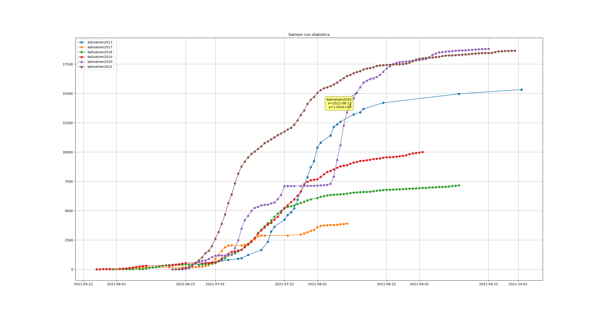

# SalmonRun

A salmon run statistics extractor and visualizer. The statistics are extracted from Swedish Lapland Fishing.

# Usage

Start by running the stat.py script, it will extract the statistics.

```
$ python stat.py --help
usage: Extracts salmon run statistics from Swedish Lapland Fishing
       [-h] [--output OUTPUT]

optional arguments:
  -h, --help       show this help message and exit
  --output OUTPUT  Path to the output directory


```

Then run the vis.py script, it will visualize the statistics.

```
$ python vis.py --help
usage: Visualizes salmon run statistics extracted from SwedishLapland Fishing by the script stat.py
       [-h] file [file ...]

positional arguments:
  file        one or several files containing salmon run statistics (typically
              generated by the script stat.py)

optional arguments:
  -h, --help  show this help message and exit
```

Note that you can use a an asterisk, SwedishLaplandFishing/kalixalven* will visualize the Kalix river statistics for
all years.

## Example

```
$ python vis.py SwedishLaplandFishing/kalixalven20*
```


